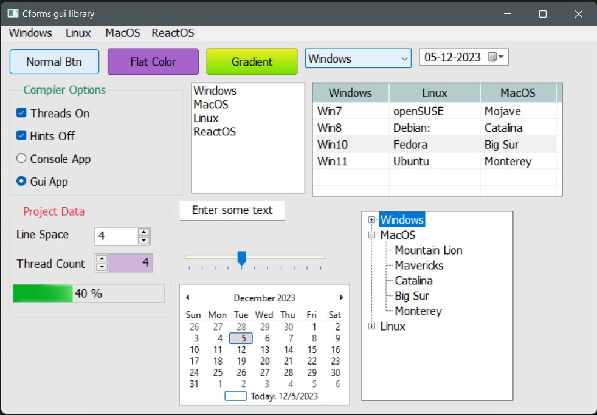

# cforms
A simple GUI library for C3 programming language, based on Win32 API

## License
This project is licensed under the MIT License.

# Screenshots




# Code sample

```c#
module cforms;

Form* frm;
Button* b1;
Button* b2;
Button* b3;
Calendar* cal;
Label* lb;
TextBox* tb;
ComboBox* cmb;
CheckBox* cb;
RadioButton* rb1;
RadioButton* rb2;
ListBox* lbx;
DateTimePicker* dtp;
NumberPicker* np1;
NumberPicker* np2;
ProgressBar* pb;
TrackBar* tk;
TreeView* tv;
GroupBox* gb;
ListView* lv;
int cntr = 1;
Timer* tm;
TrayIcon* ti;

fn void makeWindow()
{
	// exePath = getExeDir();
	frm = newForm("Cforms gui library", width:800, height:600);
	frm.onMouseDown = fn(c, e) => print("left mouse down on frm");	
	frm.createChilds = true; // Child controls will create their hwnd immediately.
	frm.createHandle();
	
	//Add a tray icon for our program
	ti = newTrayIcon("cforms sample tray icon!", "cforms.ico");
	ti.onLeftMouseDown = fn(c, e) => print("left mouse down on tray");
	ti.addContextMenu(TrayMenuTrigger.ANY_CLICK, "Button", "|", "CheckBox", "Label");
	ti.contextMenu.menus(0).onClick = fn(c,e) => print("Button menu selected from tray");

	// Let's add a timer. 400 is the ticking interval in ms.
	// onTimerTick is the tick event handler
	tm = frm.addTimer(400, &onTimerTick);

	MenuBar* mb = frm.addMenubar("Windows", "Linux", "MacOS", "ReactOS");
	mb.nativeStyle = false; // Use custom font and color.
	mb.menus("Windows").addItems("Windows8",  "Windows10", "|", "Windows11" );
	mb.menus("Linux").addItems("Debian",  "Fedora", "Ubuntu" );
	mb.menus(0).menus("Windows11").onClick = &onMenuClick;

	b1 = newButton(frm, "Normal Btn", 10, 10);
	b1.onClick = &btnClick;
	

	b2 = newButton(frm, "Flat Color", b1.right() + 10, 10);
	// b2.onMouseClick = &btnClick2;
	b2.setBackColor(0xadc178);
	b2.onClick = &onB2Click;

	b3 = newButton(frm, "Gradient", b2.right() + 10, 10);
	// // b3.setForeColor(0x1f7a1f);
	b3.setGradientColor(0xeeef20, 0x70e000); //0xeeef20, 0x70e000, 0xF4F269, 0x82C26E


	cmb = newComboBox(frm, b3.right() + 10, 10);
	cmb.addItems("Windows", "Linux", "MacOS", "ReactOS");

	dtp = newDateTimePicker(frm, cmb.right() + 10, 10);

	gb = newGroupBox(frm,"Compiler Options", 10, b1.bottom() + 10, height:150);
	gb.setForeColor(0x007f5f);	

	cb = newCheckBox(frm, "Threads On", 20, gb.ypos + 30);
	CheckBox* cb2 = newCheckBox(frm, "Hints Off", 20, cb.bottom() + 10);	

	GroupBox* gb2 = newGroupBox(frm,"Project Data", 10, gb.bottom() + 10, height:150);
	gb2.setForeColor(0xe63946);
	lb = newLabel(frm, "Line Space", 20, gb2.ypos + 30);

	np1 = newNumberPicker(frm, lb.right() + 30, gb2.ypos + 30);

	Label* lb2 = newLabel(frm, "Thread Count", 20, np1.bottom() + 14);
	np2 = newNumberPicker(frm, lb2.right() + 10, np1.bottom() + 10, btnLeft:true);
	np2.setBackColor(0xcdb4db);	

	lbx = newListBox(frm, gb.right() + 10, b1.bottom() + 10);
	lbx.addItems("Windows", "MacOS", "Linux", "ReactOS");

	lv = newListView(frm, lbx.right() + 10, b3.bottom() + 10, width:330, height:150);
	
	lv.addColumns("Windows", "Linux", "MacOS");
	lv.addRow("Win7", "openSUSE", "Mojave");
	lv.addRow("Win8", "Debian", "Catalina");
	lv.addRow("Win10", "Fedora", "Big Sur");
	lv.addRow("Win11", "Ubuntu", "Monterey");	

	lv.addContextMenu("Windows", "|", "Linux", "MacOS");
	lv.contextMenu.nativeStyle = false;
	lv.contextMenu.menus(0).onClick = &onMenuClick;

	pb = newProgressBar(frm, 15, np2.bottom() + 15);
	pb.showPercentage = true;

	rb1 = newRadioButton(frm, "Console App", 20, cb2.bottom() + 10);
	rb2 = newRadioButton(frm, "Gui App", 20, rb1.bottom() + 10);

	tb = newTextBox(frm, "Enter some text", gb2.right() + 10, lbx.bottom() + 10);
	tk = newTrackBar(frm, gb2.right() + 10, tb.bottom() + 40, evtFn: &onTrackChange );
	
	tv = newTreeView(frm, tk.right() + 70, lv.bottom() + 20, height:250);
	// tv.createHandle();
	tv.addNodeWithChilds("Windows", "Vista", "Win7", "Win8", "Win10", "Win11");
	
    tv.addNodeWithChilds("MacOS", "Mountain Lion", "Mavericks", "Catalina", "Big Sur", "Monterey");
    tv.addNodeWithChilds("Linux", "RedHat", "Mint", "Ubuntu", "Debian", "Kali");

	cal = newCalendar(frm, gb2.right() + 10, tk.bottom() + 10); 
	frm.show(); 
}


fn int main(String[] args) 
{
	mem::@report_heap_allocs_in_scope () {	
		makeWindow(); 
		return 0;
	};
}

fn void frmOnMouseDown(any sender, MouseEventArgs* e) {
	frm.printPoint(e);
	ti.showBalloon("My Balloon", "See this balloon message", 
					3500, noSound: true, icon : BalloonIcon.WARNING);
	// ti.updateIcon("D:\\Icons\\Dakirby309-Windows-8-Metro-Web-Microsoft-Store-Metro.ico");
}

fn void frmMouseDown(any sender, MouseEventArgs* e) {
	cptf("Mouse hovered %d, %d \n", e.x, e.y);
}

fn void onB2Click(any sender, EventArgs* e){
	print("Button pressed");
	// tm.start();
	ti.showBalloon("My Balloon", "this message has sound", 3500);
}

fn void onTimerTick(any sender, EventArgs* e) {
	print("Timer ticked...");
}

fn void btnClick(any sender, EventArgs* e) {	
	String inf = "D:\\Work\\Shashikumar\\2023\\Jack Ryan";
	String tf = "PDF Files|*.pdf";

	@newFileOpenDialog("Testing fod", inf, tf; FileOpenDialog fod) {
		fod.showDialog(frm.handle);
		ptf("Sel Path : %s", fod.selectedPath);
	};
}

fn void onMenuClick(any sender, EventArgs* e) {
	ptf("menu text (191) %s", (MenuItem*)sender.text);
}

fn void onTrackChange(any sender, EventArgs* e) {
	pb.setValue(tk.value);
}
```


