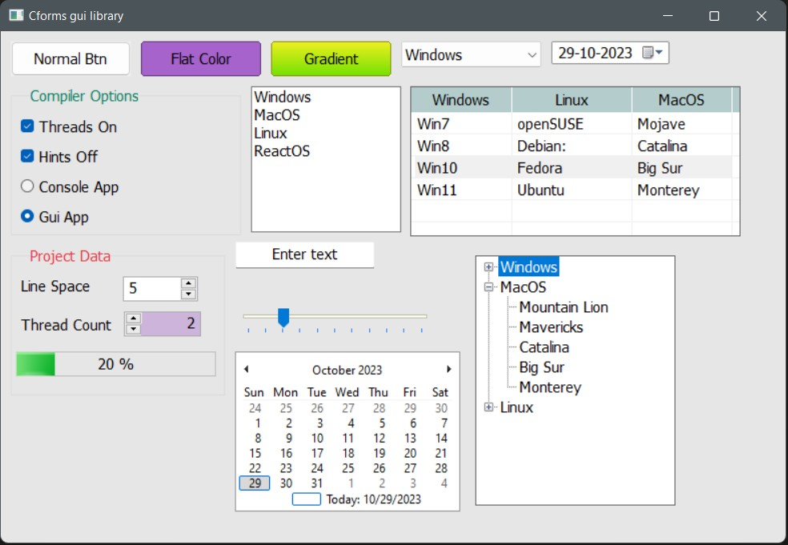

# cforms
A simple GUI library for C3 programming language, based on Win32 API

# Screenshots




# Code sample

```c
module cforms;
import std::io;
import libc;

def print = io::printn;

Form* frm;
Button* b1;
Button* b2;
Button* b3;
Calendar* cal;
Label* lb;
TextBox* tb;
ComboBox* cmb;
CheckBox* cb;
RadioButton* rb1;
RadioButton* rb2;
ListBox* lbx;
DateTimePicker* dtp;
NumberPicker* np1;
NumberPicker* np2;
ProgressBar* pb;
TrackBar* tk;
TreeView* tv;
GroupBox* gb;
ListView* lv;
// MenuBar* mb;


fn void makeWindow(TrackingAllocator* tar)
{

	frm = newForm("Cforms gui library", .width = 800, .height = 550);
	frm.createHandle();

	MenuBar* mb = frm.addMenubar("Windows", "Linux", "MacOS", "ReactOS");
	mb.menus["Windows"]!!.addItems("Windows8",  "Windows10", "|", "Windows11" );
	mb.menus["Linux"]!!.addItems("Debian",  "Fedora", "Ubuntu" );
	mb.menus["Windows"]!!.menus["Windows11"]!!.onClick = &onMenuClick;

	b1 = newButton(frm, "Normal Btn", 10, 10, .auto = true);
	// b1.onMouseClick = &btnClick;
	b2 = newButton(frm, "Flat Color", b1.right() + 10, 10, .auto = true);
	// b2.onMouseClick = &btnClick2;
	b2.setBackColor(0xa663cc);
	b3 = newButton(frm, "Gradient", b2.right() + 10, 10, .auto = true);
	// // b3.setForeColor(0x1f7a1f);
	b3.setGradientColor(0xeeef20, 0x70e000);

	cmb = newComboBox(frm, b3.right() + 10, 10, .auto = true);
	cmb.addItems("Windows", "Linux", "MacOS", "ReactOS");

	dtp = newDateTimePicker(frm, cmb.right() + 10, 10, .auto = true);

	gb = newGroupBox(frm,"Compiler Options", 10, b1.bottom() + 10, .height = 150, .auto = true);
	gb.setForeColor(0x007f5f);

	cb = newCheckBox(frm, "Threads On", 20, gb.ypos + 30, .auto = true);
	CheckBox* cb2 = newCheckBox(frm, "Hints Off", 20, cb.bottom() + 10, .auto = true);

	GroupBox* gb2 = newGroupBox(frm,"Project Data", 10, gb.bottom() + 10, .height = 150, .auto = true);
	gb2.setForeColor(0xe63946);
	lb = newLabel(frm, "Line Space", 20, gb2.ypos + 30, .auto = true);

	np1 = newNumberPicker(frm, lb.right() + 30, gb2.ypos + 30, .auto = true);

	Label* lb2 = newLabel(frm, "Thread Count", 20, np1.bottom() + 14, .auto = true);
	np2 = newNumberPicker(frm, lb2.right() + 10, np1.bottom() + 10, .auto = true, .btnLeft = true);
	np2.setBackColor(0xcdb4db);

	lbx = newListBox(frm, gb.right() + 10, b1.bottom() + 10, .auto = true);
	lbx.addItems("Windows", "MacOS", "Linux", "ReactOS");

	lv = newListView(frm, lbx.right() + 10, b3.bottom() + 10, .width = 330, .height = 150, .auto = true);
	lv.addColumns("Windows", "Linux", "MacOS", 100, 120, 100);
	lv.addRow("Win7", "openSUSE", "Mojave");
	lv.addRow("Win8", "Debian:", "Catalina");
	lv.addRow("Win10", "Fedora", "Big Sur");
	lv.addRow("Win11", "Ubuntu", "Monterey");

	pb = newProgressBar(frm, 15, np2.bottom() + 15, .auto = true);
	pb.showPercentage = true;

	rb1 = newRadioButton(frm, "Console App", 20, cb2.bottom() + 10, .auto = true);
	rb2 = newRadioButton(frm, "Gui App", 20, rb1.bottom() + 10, .auto = true);

	tb = newTextBox(frm, "Enter text", gb2.right() + 10, lbx.bottom() + 10, .auto = true);
	tk = newTrackBar(frm, gb2.right() + 10, tb.bottom() + 40, .auto = true, .evtFn = &onTrackChange );
	tv = newTreeView(frm, tk.right() + 40, lv.bottom() + 20, .height = 250, .auto = true);
	tv.addNodeWithChilds("Windows", "Vista", "Win7", "Win8", "Win10", "Win11");
    tv.addNodeWithChilds("MacOS", "Mountain Lion", "Mavericks", "Catalina", "Big Sur", "Monterey");
    tv.addNodeWithChilds("Linux", "RedHat", "Mint", "Ubuntu", "Debian", "Kali");

	cal = newCalendar(frm, gb2.right() + 10, tk.bottom() + 10, .auto = true);

	frm.show(); // All set. Show the form.
}

fn int main(String[] args)
{
	TrackingAllocator tal = startTracking(); // Cforms provide the memory tracking feature
	defer tal.free();
	mem::@scoped(&tal)
    {
		makeWindow(&tal);
	};
	printTrackReport(tal); // Show any memory leaks.
	return 0;
}

fn void frmOnMouseDown(Control* f, MouseEventArgs* e)
{
	frm.printPoint(e);
}

fn void Control.onleftClick(&self, EventArgs* e)
{
	print("Button pressed");
}


fn void onTrackChange(Control* m, EventArgs* e)
{
	pb.setValue(tk.value); // Progress bar will show the updates of track change.
}

```


